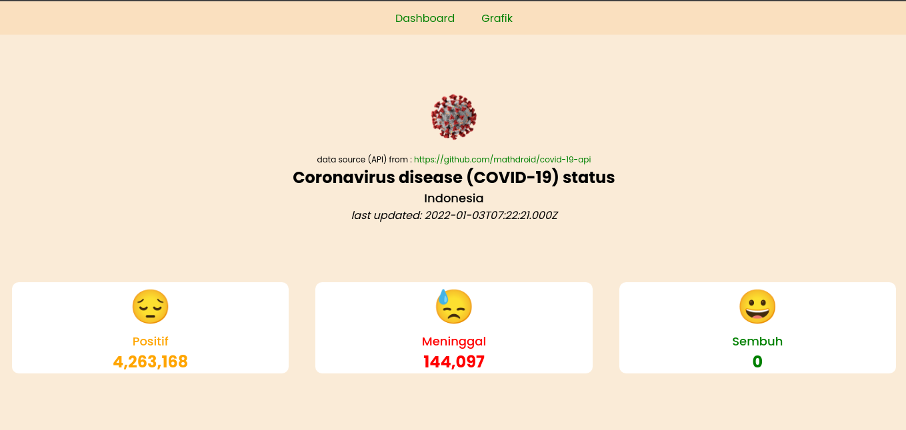

# About the Project



menampilkan status covid-19 di Indonesia

## Build With

project ini di kerjakan dengan framework dan library dibawah ini:

- [ReactJs](https://reactjs.org/)
- [react-router-dom](https://reactrouter.com/docs/en/v6)
- [chart.js](https://www.chartjs.org/)
- [react-chartjs-2](https://react-chartjs-2.netlify.app/)

# Getting Started

Project ini berjalan di atas javascript runtime nodejs, jadi pastikan nodejs terinstall dengan baik di kita.

ikuti intruksi ini untuk menginstall nodejs

[install node js](https://nodejs.org/en/)

## Installation

Ikuti langkah berikut untuk dapat menjalankan aplikasi:

1. clone the repo
   ```sh
   git clone git@github.com:ahmadnzr/reactjs-status-covid.git
   ```
2. install npm package

   ```sh
   npm install

   # or you can run `yarn`
   ```

3. Go to url [http://localhost:3000](http://localhost:3000)

# Resources

- Web API : [https://github.com/mathdroid/covid-19-api](https://github.com/mathdroid/covid-19-api)
